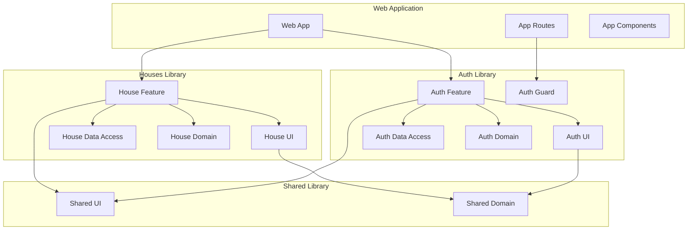

# App Initialization Design Document

## Overview

This design document outlines the implementation of a modular Angular application architecture using Nx workspace conventions and domain-driven design principles. The system will provide authentication capabilities and house/property management functionality through a clean, maintainable codebase structure with Angular Material UI components.

The implementation involves a complete workspace cleanup followed by the creation of a new "web" application and three core libraries (auth, houses, shared) organized using DDD layering patterns. The architecture emphasizes separation of concerns, reusability, and maintainability while following Angular and Nx best practices. The system uses Angular Material for consistent UI components including tables, accordions, forms, and dropdowns.

## Architecture

### High-Level Architecture

The application follows a layered architecture pattern with clear separation between presentation, business logic, and data access layers:



### Domain-Driven Design Structure

Each library follows a consistent DDD structure with four layers:

1. **Domain Layer**: Core business models, rules, and entities
2. **Data Access Layer**: API communication, state management, and data mapping
3. **Feature Layer**: Business logic orchestration, facades, and routing
4. **UI Layer**: Presentational components and layouts

### Nx Workspace Organization

The workspace will be organized following Nx conventions:
- Applications in `apps/` directory
- Libraries in `libs/` directory with domain-specific grouping
- Shared utilities and components in dedicated shared library
- Clear dependency boundaries between layers

### Angular Material Integration

The system integrates Angular Material throughout for consistent UI components:
- **Tables**: Mat-table with expansion panels for house listings
- **Forms**: Mat-form-field, mat-input, mat-select for house creation/editing
- **Navigation**: Mat-toolbar, mat-sidenav for application layout
- **Feedback**: Mat-snackbar for notifications, mat-progress-spinner for loading
- **Data Display**: Mat-card for house details, mat-accordion for expandable content

## Components and Interfaces

### Web Application

**Main Application (`apps/web`)**
- **Purpose**: Entry point and routing configuration with Angular Material theming
- **Key Components**:
  - `AppComponent`: Root application component with Material toolbar and navigation
  - `app.routes.ts`: Main routing configuration with auth guard integration
  - `main.ts`: Bootstrap configuration with Material theme setup

**Routing Strategy**:
- House list page remains publicly accessible
- House detail/edit pages are protected by authentication guard
- Create house functionality only available to authenticated users
- Lazy loading for feature modules

### Auth Library (`libs/auth`)

**Domain Layer (`auth/domain`)**
- **Models**:
  - `AuthUser`: User authentication model with id, email, roles
  - `AuthToken`: JWT token model with access/refresh tokens and expiration
  - `LoginCredentials`: Login request model
- **Business Rules**:
  - Token expiration validation
  - User role authorization logic
  - Password strength requirements

**Data Access Layer (`auth/data-access`)**
- **Services**:
  - `AuthApiService`: HTTP client for authentication endpoints
  - `AuthStore`: NgRx store for authentication state management (NO BehaviorSubject/Subject)
  - `TokenService`: Token storage and management utilities
- **State Management**:
  - Authentication status (authenticated/unauthenticated)
  - Current user information
  - Token refresh handling
  - All state managed exclusively through NgRx store
  - No direct store access from components - only through facade

**Feature Layer (`auth/feature`)**
- **Components**:
  - `LoginComponent`: Login form container with Material design
  - `AuthLayoutComponent`: Authentication page layout with Material components
- **Guards**:
  - `AuthGuard`: Route protection implementation
- **Facades**:
  - `AuthFacade`: **CRITICAL** - Simplified interface for authentication operations, provides type-safe access to NgRx store
  - All components must use facade instead of direct store access
  - Facade encapsulates all store selectors and actions
- **Routing**:
  - Authentication-specific routes (login, logout)

**UI Layer (`auth/ui`)**
- **Components**:
  - `LoginFormComponent`: Reusable login form with Material form fields
  - `AuthButtonComponent`: Authentication action buttons with Material styling
  - `UserProfileComponent`: User information display with Material card

### Houses Library (`libs/houses`)

**Domain Layer (`houses/domain`)**
- **Models**:
  - `House`: Core house entity with houseNumber, blockNumber, landNumber, houseType, houseModel, price, status, media, description
  - `HouseType`: Enumeration for house types (Apartment, Townhouse, Villa)
  - `HouseStatus`: Enumeration for house status (Available, Booked)
  - `HouseFilter`: Search and filter criteria for block, land, price range
- **Business Rules**:
  - House validation logic
  - Price formatting rules (Indonesian Rupiah)
  - Status transition rules

**Data Access Layer (`houses/data-access`)**
- **Services**:
  - `HouseApiService`: HTTP client for house endpoints
  - `HouseStore`: NgRx store for house state management (NO BehaviorSubject/Subject)
  - `HouseCacheService`: House data caching strategy
- **State Management**:
  - House list with pagination and filtering
  - Selected house details
  - Loading and error states
  - All state managed exclusively through NgRx store
  - No direct store access from components - only through facade

**Feature Layer (`houses/feature`)**
- **Components**:
  - `HouseListComponent`: House listing container with Material table and accordion
  - `HouseDetailComponent`: House detail container (protected by AuthGuard)
  - `HouseCreateComponent`: House creation form (protected by AuthGuard)
- **Facades**:
  - `HouseFacade`: **CRITICAL** - Simplified interface for house operations, provides type-safe access to NgRx store
  - All components must use facade instead of direct store access
  - Facade encapsulates all store selectors and actions
- **Routing**:
  - House-specific routes (list public, detail/create protected)

**UI Layer (`houses/ui`)**
- **Components**:
  - `HouseCardComponent`: Individual house display with Material card
  - `HouseTableComponent`: House table with Material table and expansion panels
  - `HouseFilterComponent`: Filter controls with Material dropdowns (block, land, price range)
  - `HouseFormComponent`: House creation/edit form with Material form controls

### Shared Library (`libs/shared`)

**Domain Layer (`shared/domain`)**
- **Models**:
  - `BaseEntity`: Common entity properties (id, createdAt, updatedAt)
  - `PaginationRequest`: Pagination parameters
  - `PaginationResponse`: Paginated response wrapper
  - `ApiResponse`: Standard API response format

**UI Layer (`shared/ui`)**
- **Components**:
  - `ButtonComponent`: Standardized button with Material variants
  - `ModalComponent`: Reusable modal dialog with Material dialog
  - `TableComponent`: Data table with Material table, sorting and pagination
  - `LoadingSpinnerComponent`: Loading indicator with Material progress spinner
  - `ErrorMessageComponent`: Error display component with Material snackbar
  - `FormFieldComponent`: Standardized form field wrapper with Material form field
  - `DropdownComponent`: Reusable dropdown with Material select

## Data Models

About the models, please follow the concept below:
The model is the class, not the interface
the model file will contain 3 part: 
1. MAPPING_FIELD Enum
2 ConvertToReqBody interface
3. Model Class

### Authentication Models

```typescript
// Auth User Model
export enum AUTH_USER_MAPPING_FIELD {
  id = 'id',
  email = 'email',
  firstName = 'firstName',
  lastName = 'lastName',
  roles = 'roles',
  isActive = 'isActive',
  createdAt = 'createdAt',
  updatedAt = 'updatedAt'
}

export interface AuthUserConvertToReqBody {
  [AUTH_USER_MAPPING_FIELD.id]: string;
  [AUTH_USER_MAPPING_FIELD.email]: string;
  [AUTH_USER_MAPPING_FIELD.firstName]: string;
  [AUTH_USER_MAPPING_FIELD.lastName]: string;
  [AUTH_USER_MAPPING_FIELD.roles]: string[];
  [AUTH_USER_MAPPING_FIELD.isActive]: boolean;
}

export class AuthUserModel {
  id!: string;
  email!: string;
  firstName!: string;
  lastName!: string;
  roles!: string[];
  isActive!: boolean;
  createdAt!: Date;
  updatedAt!: Date;

  constructor(respObject: any, isFromBackend = true) {
    if (isFromBackend) {
      this.parseFromBackend(respObject);
    } else {
      this.id = respObject.id;
      this.email = respObject.email;
      this.firstName = respObject.firstName;
      this.lastName = respObject.lastName;
      this.roles = respObject.roles;
      this.isActive = respObject.isActive;
      this.createdAt = respObject.createdAt;
      this.updatedAt = respObject.updatedAt;
    }
  }

  private parseFromBackend(respObject: any) {
    this.id = respObject[AUTH_USER_MAPPING_FIELD.id];
    this.email = respObject[AUTH_USER_MAPPING_FIELD.email];
    this.firstName = respObject[AUTH_USER_MAPPING_FIELD.firstName];
    this.lastName = respObject[AUTH_USER_MAPPING_FIELD.lastName];
    this.roles = respObject[AUTH_USER_MAPPING_FIELD.roles];
    this.isActive = respObject[AUTH_USER_MAPPING_FIELD.isActive];
    this.createdAt = new Date(respObject[AUTH_USER_MAPPING_FIELD.createdAt]);
    this.updatedAt = new Date(respObject[AUTH_USER_MAPPING_FIELD.updatedAt]);
  }

  public convertToReqBody(): AuthUserConvertToReqBody {
    return {
      [AUTH_USER_MAPPING_FIELD.id]: this.id,
      [AUTH_USER_MAPPING_FIELD.email]: this.email,
      [AUTH_USER_MAPPING_FIELD.firstName]: this.firstName,
      [AUTH_USER_MAPPING_FIELD.lastName]: this.lastName,
      [AUTH_USER_MAPPING_FIELD.roles]: this.roles,
      [AUTH_USER_MAPPING_FIELD.isActive]: this.isActive
    };
  }

  public getFullName(): string {
    return `${this.firstName} ${this.lastName}`;
  }
}

// Auth Token Model
export enum AUTH_TOKEN_MAPPING_FIELD {
  accessToken = 'accessToken',
  refreshToken = 'refreshToken',
  expiresIn = 'expiresIn',
  tokenType = 'tokenType'
}

export interface AuthTokenConvertToReqBody {
  [AUTH_TOKEN_MAPPING_FIELD.accessToken]: string;
  [AUTH_TOKEN_MAPPING_FIELD.refreshToken]: string;
  [AUTH_TOKEN_MAPPING_FIELD.expiresIn]: number;
  [AUTH_TOKEN_MAPPING_FIELD.tokenType]: string;
}

export class AuthTokenModel {
  accessToken!: string;
  refreshToken!: string;
  expiresIn!: number;
  tokenType!: string;

  constructor(respObject: any, isFromBackend = true) {
    if (isFromBackend) {
      this.parseFromBackend(respObject);
    } else {
      this.accessToken = respObject.accessToken;
      this.refreshToken = respObject.refreshToken;
      this.expiresIn = respObject.expiresIn;
      this.tokenType = respObject.tokenType;
    }
  }

  private parseFromBackend(respObject: any) {
    this.accessToken = respObject[AUTH_TOKEN_MAPPING_FIELD.accessToken];
    this.refreshToken = respObject[AUTH_TOKEN_MAPPING_FIELD.refreshToken];
    this.expiresIn = respObject[AUTH_TOKEN_MAPPING_FIELD.expiresIn];
    this.tokenType = respObject[AUTH_TOKEN_MAPPING_FIELD.tokenType];
  }

  public convertToReqBody(): AuthTokenConvertToReqBody {
    return {
      [AUTH_TOKEN_MAPPING_FIELD.accessToken]: this.accessToken,
      [AUTH_TOKEN_MAPPING_FIELD.refreshToken]: this.refreshToken,
      [AUTH_TOKEN_MAPPING_FIELD.expiresIn]: this.expiresIn,
      [AUTH_TOKEN_MAPPING_FIELD.tokenType]: this.tokenType
    };
  }

  public isExpired(): boolean {
    return Date.now() >= this.expiresIn * 1000;
  }
}

// Login Credentials Model
export enum LOGIN_CREDENTIALS_MAPPING_FIELD {
  email = 'email',
  password = 'password',
  rememberMe = 'rememberMe'
}

export interface LoginCredentialsConvertToReqBody {
  [LOGIN_CREDENTIALS_MAPPING_FIELD.email]: string;
  [LOGIN_CREDENTIALS_MAPPING_FIELD.password]: string;
  [LOGIN_CREDENTIALS_MAPPING_FIELD.rememberMe]?: boolean;
}

export class LoginCredentialsModel {
  email!: string;
  password!: string;
  rememberMe?: boolean;

  constructor(respObject: any, isFromBackend = true) {
    if (isFromBackend) {
      this.parseFromBackend(respObject);
    } else {
      this.email = respObject.email;
      this.password = respObject.password;
      this.rememberMe = respObject.rememberMe;
    }
  }

  private parseFromBackend(respObject: any) {
    this.email = respObject[LOGIN_CREDENTIALS_MAPPING_FIELD.email];
    this.password = respObject[LOGIN_CREDENTIALS_MAPPING_FIELD.password];
    this.rememberMe = respObject[LOGIN_CREDENTIALS_MAPPING_FIELD.rememberMe];
  }

  public convertToReqBody(): LoginCredentialsConvertToReqBody {
    return {
      [LOGIN_CREDENTIALS_MAPPING_FIELD.email]: this.email,
      [LOGIN_CREDENTIALS_MAPPING_FIELD.password]: this.password,
      [LOGIN_CREDENTIALS_MAPPING_FIELD.rememberMe]: this.rememberMe
    };
  }
}
```

### House Models

```typescript
// House Model
export enum HOUSE_MAPPING_FIELD {
  id = 'id',
  houseNumber = 'houseNumber',
  blockNumber = 'blockNumber',
  landNumber = 'landNumber',
  houseType = 'houseType',
  houseModel = 'houseModel',
  price = 'price',
  status = 'status',
  media = 'media',
  description = 'description',
  createdAt = 'createdAt',
  updatedAt = 'updatedAt'
}

export interface HouseConvertToReqBody {
  [HOUSE_MAPPING_FIELD.id]: string;
  [HOUSE_MAPPING_FIELD.houseNumber]: string;
  [HOUSE_MAPPING_FIELD.blockNumber]: string;
  [HOUSE_MAPPING_FIELD.landNumber]: string;
  [HOUSE_MAPPING_FIELD.houseType]: HouseType;
  [HOUSE_MAPPING_FIELD.houseModel]: string;
  [HOUSE_MAPPING_FIELD.price]: number;
  [HOUSE_MAPPING_FIELD.status]: HouseStatus;
  [HOUSE_MAPPING_FIELD.media]?: string[];
  [HOUSE_MAPPING_FIELD.description]?: string;
}

export enum HouseType {
  APARTMENT = 'Apartment',
  TOWNHOUSE = 'Townhouse',
  VILLA = 'Villa'
}

export enum HouseStatus {
  AVAILABLE = 'Available',
  BOOKED = 'Booked'
}

export class HouseModel {
  id!: string;
  houseNumber!: string;
  blockNumber!: string;
  landNumber!: string;
  houseType!: HouseType;
  houseModel!: string;
  price!: number;
  status!: HouseStatus;
  media?: string[];
  description?: string;
  createdAt!: Date;
  updatedAt!: Date;

  constructor(respObject: any, isFromBackend = true) {
    if (isFromBackend) {
      this.parseFromBackend(respObject);
    } else {
      this.id = respObject.id;
      this.houseNumber = respObject.houseNumber;
      this.blockNumber = respObject.blockNumber;
      this.landNumber = respObject.landNumber;
      this.houseType = respObject.houseType;
      this.houseModel = respObject.houseModel;
      this.price = respObject.price;
      this.status = respObject.status;
      this.media = respObject.media;
      this.description = respObject.description;
      this.createdAt = respObject.createdAt;
      this.updatedAt = respObject.updatedAt;
    }
  }

  private parseFromBackend(respObject: any) {
    this.id = respObject[HOUSE_MAPPING_FIELD.id];
    this.houseNumber = respObject[HOUSE_MAPPING_FIELD.houseNumber];
    this.blockNumber = respObject[HOUSE_MAPPING_FIELD.blockNumber];
    this.landNumber = respObject[HOUSE_MAPPING_FIELD.landNumber];
    this.houseType = respObject[HOUSE_MAPPING_FIELD.houseType];
    this.houseModel = respObject[HOUSE_MAPPING_FIELD.houseModel];
    this.price = respObject[HOUSE_MAPPING_FIELD.price];
    this.status = respObject[HOUSE_MAPPING_FIELD.status];
    this.media = respObject[HOUSE_MAPPING_FIELD.media];
    this.description = respObject[HOUSE_MAPPING_FIELD.description];
    this.createdAt = new Date(respObject[HOUSE_MAPPING_FIELD.createdAt]);
    this.updatedAt = new Date(respObject[HOUSE_MAPPING_FIELD.updatedAt]);
  }

  public convertToReqBody(): HouseConvertToReqBody {
    return {
      [HOUSE_MAPPING_FIELD.id]: this.id,
      [HOUSE_MAPPING_FIELD.houseNumber]: this.houseNumber,
      [HOUSE_MAPPING_FIELD.blockNumber]: this.blockNumber,
      [HOUSE_MAPPING_FIELD.landNumber]: this.landNumber,
      [HOUSE_MAPPING_FIELD.houseType]: this.houseType,
      [HOUSE_MAPPING_FIELD.houseModel]: this.houseModel,
      [HOUSE_MAPPING_FIELD.price]: this.price,
      [HOUSE_MAPPING_FIELD.status]: this.status,
      [HOUSE_MAPPING_FIELD.media]: this.media,
      [HOUSE_MAPPING_FIELD.description]: this.description
    };
  }

  public getFormattedPrice(): string {
    return new Intl.NumberFormat('id-ID', {
      style: 'currency',
      currency: 'IDR',
      minimumFractionDigits: 0
    }).format(this.price);
  }

  public getFullHouseNumber(): string {
    return `${this.blockNumber}-${this.landNumber}-${this.houseNumber.split('-').pop()}`;
  }

  public isAvailable(): boolean {
    return this.status === HouseStatus.AVAILABLE;
  }
}

// House Filter Model
export enum HOUSE_FILTER_MAPPING_FIELD {
  blockNumber = 'blockNumber',
  landNumber = 'landNumber',
  minPrice = 'minPrice',
  maxPrice = 'maxPrice',
  houseType = 'houseType',
  status = 'status',
  sortBy = 'sortBy',
  sortOrder = 'sortOrder'
}

export interface HouseFilterConvertToReqBody {
  [HOUSE_FILTER_MAPPING_FIELD.blockNumber]?: string;
  [HOUSE_FILTER_MAPPING_FIELD.landNumber]?: string;
  [HOUSE_FILTER_MAPPING_FIELD.minPrice]?: number;
  [HOUSE_FILTER_MAPPING_FIELD.maxPrice]?: number;
  [HOUSE_FILTER_MAPPING_FIELD.houseType]?: HouseType;
  [HOUSE_FILTER_MAPPING_FIELD.status]?: HouseStatus;
  [HOUSE_FILTER_MAPPING_FIELD.sortBy]?: string;
  [HOUSE_FILTER_MAPPING_FIELD.sortOrder]?: string;
}

export class HouseFilterModel {
  blockNumber?: string;
  landNumber?: string;
  priceRange?: {
    min: number;
    max: number;
  };
  houseType?: HouseType;
  status?: HouseStatus;
  sortBy?: 'houseNumber' | 'price' | 'createdAt';
  sortOrder?: 'asc' | 'desc';

  constructor(respObject: any, isFromBackend = true) {
    if (isFromBackend) {
      this.parseFromBackend(respObject);
    } else {
      this.blockNumber = respObject.blockNumber;
      this.landNumber = respObject.landNumber;
      this.priceRange = respObject.priceRange;
      this.houseType = respObject.houseType;
      this.status = respObject.status;
      this.sortBy = respObject.sortBy;
      this.sortOrder = respObject.sortOrder;
    }
  }

  private parseFromBackend(respObject: any) {
    this.blockNumber = respObject[HOUSE_FILTER_MAPPING_FIELD.blockNumber];
    this.landNumber = respObject[HOUSE_FILTER_MAPPING_FIELD.landNumber];
    this.priceRange = {
      min: respObject[HOUSE_FILTER_MAPPING_FIELD.minPrice],
      max: respObject[HOUSE_FILTER_MAPPING_FIELD.maxPrice]
    };
    this.houseType = respObject[HOUSE_FILTER_MAPPING_FIELD.houseType];
    this.status = respObject[HOUSE_FILTER_MAPPING_FIELD.status];
    this.sortBy = respObject[HOUSE_FILTER_MAPPING_FIELD.sortBy];
    this.sortOrder = respObject[HOUSE_FILTER_MAPPING_FIELD.sortOrder];
  }

  public convertToReqBody(): HouseFilterConvertToReqBody {
    return {
      [HOUSE_FILTER_MAPPING_FIELD.blockNumber]: this.blockNumber,
      [HOUSE_FILTER_MAPPING_FIELD.landNumber]: this.landNumber,
      [HOUSE_FILTER_MAPPING_FIELD.minPrice]: this.priceRange?.min,
      [HOUSE_FILTER_MAPPING_FIELD.maxPrice]: this.priceRange?.max,
      [HOUSE_FILTER_MAPPING_FIELD.houseType]: this.houseType,
      [HOUSE_FILTER_MAPPING_FIELD.status]: this.status,
      [HOUSE_FILTER_MAPPING_FIELD.sortBy]: this.sortBy,
      [HOUSE_FILTER_MAPPING_FIELD.sortOrder]: this.sortOrder
    };
  }
}
```

### Shared Models

```typescript
// Base Entity Model
export enum BASE_ENTITY_MAPPING_FIELD {
  id = 'id',
  createdAt = 'createdAt',
  updatedAt = 'updatedAt'
}

export interface BaseEntityConvertToReqBody {
  [BASE_ENTITY_MAPPING_FIELD.id]: string;
}

export class BaseEntityModel {
  id!: string;
  createdAt!: Date;
  updatedAt!: Date;

  constructor(respObject: any, isFromBackend = true) {
    if (isFromBackend) {
      this.parseFromBackend(respObject);
    } else {
      this.id = respObject.id;
      this.createdAt = respObject.createdAt;
      this.updatedAt = respObject.updatedAt;
    }
  }

  private parseFromBackend(respObject: any) {
    this.id = respObject[BASE_ENTITY_MAPPING_FIELD.id];
    this.createdAt = new Date(respObject[BASE_ENTITY_MAPPING_FIELD.createdAt]);
    this.updatedAt = new Date(respObject[BASE_ENTITY_MAPPING_FIELD.updatedAt]);
  }

  public convertToReqBody(): BaseEntityConvertToReqBody {
    return {
      [BASE_ENTITY_MAPPING_FIELD.id]: this.id
    };
  }
}

// Pagination Request Model
export enum PAGINATION_REQUEST_MAPPING_FIELD {
  page = 'page',
  limit = 'limit'
}

export interface PaginationRequestConvertToReqBody {
  [PAGINATION_REQUEST_MAPPING_FIELD.page]: number;
  [PAGINATION_REQUEST_MAPPING_FIELD.limit]: number;
}

export class PaginationRequestModel {
  page!: number;
  limit!: number;

  constructor(respObject: any, isFromBackend = true) {
    if (isFromBackend) {
      this.parseFromBackend(respObject);
    } else {
      this.page = respObject.page;
      this.limit = respObject.limit;
    }
  }

  private parseFromBackend(respObject: any) {
    this.page = respObject[PAGINATION_REQUEST_MAPPING_FIELD.page];
    this.limit = respObject[PAGINATION_REQUEST_MAPPING_FIELD.limit];
  }

  public convertToReqBody(): PaginationRequestConvertToReqBody {
    return {
      [PAGINATION_REQUEST_MAPPING_FIELD.page]: this.page,
      [PAGINATION_REQUEST_MAPPING_FIELD.limit]: this.limit
    };
  }

  public getOffset(): number {
    return (this.page - 1) * this.limit;
  }
}

// Pagination Response Model
export enum PAGINATION_RESPONSE_MAPPING_FIELD {
  data = 'data',
  total = 'total',
  page = 'page',
  limit = 'limit',
  totalPages = 'totalPages'
}

export interface PaginationResponseConvertToReqBody<T> {
  [PAGINATION_RESPONSE_MAPPING_FIELD.data]: T[];
  [PAGINATION_RESPONSE_MAPPING_FIELD.total]: number;
  [PAGINATION_RESPONSE_MAPPING_FIELD.page]: number;
  [PAGINATION_RESPONSE_MAPPING_FIELD.limit]: number;
  [PAGINATION_RESPONSE_MAPPING_FIELD.totalPages]: number;
}

export class PaginationResponseModel<T> {
  data!: T[];
  total!: number;
  page!: number;
  limit!: number;
  totalPages!: number;

  constructor(respObject: any, isFromBackend = true) {
    if (isFromBackend) {
      this.parseFromBackend(respObject);
    } else {
      this.data = respObject.data;
      this.total = respObject.total;
      this.page = respObject.page;
      this.limit = respObject.limit;
      this.totalPages = respObject.totalPages;
    }
  }

  private parseFromBackend(respObject: any) {
    this.data = respObject[PAGINATION_RESPONSE_MAPPING_FIELD.data];
    this.total = respObject[PAGINATION_RESPONSE_MAPPING_FIELD.total];
    this.page = respObject[PAGINATION_RESPONSE_MAPPING_FIELD.page];
    this.limit = respObject[PAGINATION_RESPONSE_MAPPING_FIELD.limit];
    this.totalPages = respObject[PAGINATION_RESPONSE_MAPPING_FIELD.totalPages];
  }

  public convertToReqBody(): PaginationResponseConvertToReqBody<T> {
    return {
      [PAGINATION_RESPONSE_MAPPING_FIELD.data]: this.data,
      [PAGINATION_RESPONSE_MAPPING_FIELD.total]: this.total,
      [PAGINATION_RESPONSE_MAPPING_FIELD.page]: this.page,
      [PAGINATION_RESPONSE_MAPPING_FIELD.limit]: this.limit,
      [PAGINATION_RESPONSE_MAPPING_FIELD.totalPages]: this.totalPages
    };
  }

  public hasNextPage(): boolean {
    return this.page < this.totalPages;
  }

  public hasPreviousPage(): boolean {
    return this.page > 1;
  }
}

// API Response Model
export enum API_RESPONSE_MAPPING_FIELD {
  success = 'success',
  data = 'data',
  error = 'error',
  message = 'message'
}

export interface ApiResponseConvertToReqBody<T> {
  [API_RESPONSE_MAPPING_FIELD.success]: boolean;
  [API_RESPONSE_MAPPING_FIELD.data]?: T;
  [API_RESPONSE_MAPPING_FIELD.error]?: string;
  [API_RESPONSE_MAPPING_FIELD.message]?: string;
}

export class ApiResponseModel<T> {
  success!: boolean;
  data?: T;
  error?: string;
  message?: string;

  constructor(respObject: any, isFromBackend = true) {
    if (isFromBackend) {
      this.parseFromBackend(respObject);
    } else {
      this.success = respObject.success;
      this.data = respObject.data;
      this.error = respObject.error;
      this.message = respObject.message;
    }
  }

  private parseFromBackend(respObject: any) {
    this.success = respObject[API_RESPONSE_MAPPING_FIELD.success];
    this.data = respObject[API_RESPONSE_MAPPING_FIELD.data];
    this.error = respObject[API_RESPONSE_MAPPING_FIELD.error];
    this.message = respObject[API_RESPONSE_MAPPING_FIELD.message];
  }

  public convertToReqBody(): ApiResponseConvertToReqBody<T> {
    return {
      [API_RESPONSE_MAPPING_FIELD.success]: this.success,
      [API_RESPONSE_MAPPING_FIELD.data]: this.data,
      [API_RESPONSE_MAPPING_FIELD.error]: this.error,
      [API_RESPONSE_MAPPING_FIELD.message]: this.message
    };
  }

  public isSuccess(): boolean {
    return this.success && !this.error;
  }

  public isError(): boolean {
    return !this.success || !!this.error;
  }
}
```

## Implementation Strategy

### Phase 1: Workspace Cleanup
1. Remove existing applications (api, shop, shop-e2e)
2. Remove existing libraries (api/products, shared/models, shop/*)
3. Clean up configuration files (nx.json, workspace.json)
4. Verify clean workspace state

### Phase 2: Core Structure Creation
1. Generate new "web" application using Nx Angular schematic
2. Install and configure Angular Material
3. Create library structure for auth, houses, and shared
4. Set up proper library dependencies and import paths
5. Configure TypeScript path mapping

### Phase 3: Angular Material Setup
1. Install Angular Material and CDK
2. Configure Material theme and typography
3. Set up Material icons and fonts
4. Create Material module for shared components
5. Configure global Material styles

### Phase 4: Shared Foundation
1. Implement shared domain models (BaseEntity, Pagination)
2. Create shared UI components with Material design (Button, Modal, Table)
3. Set up shared utilities and constants
4. Establish Material design system foundations

### Phase 5: Authentication Implementation
1. Implement auth domain models and business rules
2. Create auth data access layer with NgRx store
3. Build authentication UI components with Material forms
4. Implement AuthGuard for route protection
5. Set up login/logout functionality with Material feedback

### Phase 6: House Management
1. Implement house domain models with proper enums
2. Create house data access layer with filtering support
3. Build house UI components with Material table and accordion
4. Implement house listing (public) and detail/create views (protected)
5. Set up house filtering with Material dropdowns and form controls

### Phase 7: Integration and Routing
1. Configure main application routing with auth protection
2. Apply AuthGuard to house detail and create routes
3. Set up lazy loading for feature modules
4. Implement navigation with Material toolbar and sidenav
5. Test end-to-end functionality with Material feedback components

### Dependency Management

**Library Dependencies**:
- `shared` → No dependencies (foundation layer)
- `auth` → Depends on `shared/domain`, `shared/ui`
- `houses` → Depends on `shared/domain`, `shared/ui`
- `web` → Depends on `auth/feature`, `houses/feature`, `shared/ui`

**Technology Stack**:
- Angular 17+ with standalone components
- Angular Material 17+ for UI components
- NgRx for state management
- Angular Router for navigation with guards
- RxJS for reactive programming
- Nx for workspace management
- TypeScript for type safety

## Correctness Properties

*A property is a characteristic or behavior that should hold true across all valid executions of a system—essentially, a formal statement about what the system should do. Properties serve as the bridge between human-readable specifications and machine-verifiable correctness guarantees.*

Based on the prework analysis, most of the acceptance criteria for this workspace initialization project are structural verification requirements that are best tested as specific examples rather than universal properties. The following properties capture the essential correctness requirements:

**Property 1: Workspace cleanup completeness**
*For any* workspace cleanup operation, all specified existing applications and libraries should be completely removed with no remaining artifacts
**Validates: Requirements US1.1, US1.2**

**Property 2: Library structure consistency**
*For any* created library (auth, houses, shared), the directory structure should follow the specified DDD pattern with all required layers present
**Validates: Requirements US1.4, US2.1, US3.1**

**Property 3: Shared component reusability**
*For any* shared component or model, it should be properly exported and importable by other libraries without circular dependencies
**Validates: Requirements US4.3**

**Property 4: Angular Material integration consistency**
*For any* UI component that uses Material design, it should follow Material design principles and use proper Material components
**Validates: Requirements US3.1, US4.1**

**Property 5: Authentication guard protection**
*For any* protected route (house detail, house create), access should be denied when user is not authenticated
**Validates: Requirements US2.1**

The remaining acceptance criteria are best verified through specific structural tests that check for the existence and proper configuration of specific files, directories, and components as outlined in the requirements.

## Error Handling

### Workspace Cleanup Errors
- **Missing Applications/Libraries**: If specified applications or libraries don't exist during cleanup, log warnings but continue with cleanup process
- **Permission Errors**: Handle file system permission issues gracefully with clear error messages using Material snackbar
- **Configuration File Corruption**: Validate and repair nx.json and workspace configuration files if corrupted

### Angular Material Setup Errors
- **Theme Configuration**: Handle Material theme setup failures with fallback to default theme
- **Icon Loading**: Provide fallback icons when Material icons fail to load
- **Component Import**: Clear error messages for missing Material module imports

### Library Generation Errors
- **Naming Conflicts**: Prevent creation of libraries with conflicting names or paths
- **Invalid Structure**: Validate that generated library structure matches DDD requirements
- **Dependency Resolution**: Handle cases where library dependencies cannot be resolved
- **Material Module**: Ensure Material modules are properly imported in each library

### Authentication Errors
- **Invalid Credentials**: Provide clear feedback using Material snackbar for authentication failures
- **Token Expiration**: Implement automatic token refresh with fallback to login using Material dialog
- **Network Failures**: Handle API communication errors with retry mechanisms and Material progress indicators
- **Guard Failures**: Redirect to login page when authentication guard fails with Material navigation

### House Management Errors
- **Data Loading Failures**: Implement loading states using Material progress spinner and error messages for house data
- **Invalid House Data**: Validate house models and handle malformed data gracefully with Material form validation
- **Filter Errors**: Handle invalid filter combinations with Material form field error messages
- **Pagination Errors**: Handle edge cases in pagination (empty results, invalid page numbers) with Material feedback

### Shared Component Errors
- **Missing Dependencies**: Validate that shared components have all required Material dependencies
- **Type Safety**: Ensure proper TypeScript typing for all shared models and interfaces
- **Import Errors**: Provide clear error messages for incorrect component imports using Material snackbar
- **Material Theme**: Handle cases where Material theme is not properly configured

## Testing Strategy

### Dual Testing Approach

This project requires both unit testing and property-based testing to ensure comprehensive coverage:

**Unit Tests**: Focus on specific structural verifications, component functionality, and integration points
**Property Tests**: Verify universal properties across different workspace configurations and library structures

### Unit Testing Strategy

**Workspace Structure Tests**:
- Verify removal of specific existing applications and libraries
- Confirm creation of new web application with correct configuration
- Validate library structure matches DDD requirements exactly
- Test Nx configuration file updates (nx.json, project.json)
- Verify Angular Material installation and configuration

**Authentication Module Tests**:
- Test AuthGuard behavior with valid/invalid tokens
- Verify login component functionality and Material form validation
- Test token storage and retrieval mechanisms
- Validate authentication state management in NgRx store
- Test Material UI integration in auth components

**House Module Tests**:
- Test house listing component with Material table and accordion
- Verify house detail and create component functionality with Material forms
- Test house data access layer functionality
- Test house routing configuration (public list, protected detail/create)
- Validate house model validation and transformation
- Test Material filter components (dropdowns, price range)

**Shared Component Tests**:
- Test individual shared UI components with Material design
- Verify shared domain model functionality
- Test component reusability across different contexts
- Validate proper TypeScript typing and interfaces
- Test Material theme integration

### Property-Based Testing Strategy

**Property Test Configuration**:
- Use Jest with fast-check library for property-based testing
- Configure minimum 100 iterations per property test
- Tag each test with feature name and property reference

**Property Test Implementation**:

```typescript
// Example property test structure
describe('Feature: app-initialization, Property 1: Workspace cleanup completeness', () => {
  it('should remove all specified artifacts completely', () => {
    // Property test implementation
  });
});

describe('Feature: app-initialization, Property 2: Library structure consistency', () => {
  it('should maintain DDD structure across all libraries', () => {
    // Property test implementation
  });
});

describe('Feature: app-initialization, Property 3: Shared component reusability', () => {
  it('should allow import without circular dependencies', () => {
    // Property test implementation
  });
});

describe('Feature: app-initialization, Property 4: Angular Material integration consistency', () => {
  it('should follow Material design principles across all components', () => {
    // Property test implementation
  });
});

describe('Feature: app-initialization, Property 5: Authentication guard protection', () => {
  it('should deny access to protected routes when not authenticated', () => {
    // Property test implementation
  });
});
```

### Integration Testing

**End-to-End Workflow Tests**:
- Complete workspace cleanup and recreation process
- Authentication flow from login to protected route access with Material UI
- House browsing without authentication requirements
- House creation/editing with authentication requirements
- Cross-library component usage and dependency resolution
- Material theme consistency across all components

### Testing Tools and Configuration

**Unit Testing**: Jest with Angular Testing Utilities and Angular Material testing harness
**Property-Based Testing**: fast-check library with Jest
**E2E Testing**: Cypress for end-to-end workflow validation with Material component interaction
**Code Coverage**: Minimum 80% coverage for all libraries
**Linting**: ESLint with Angular, Nx, and Material rules
**Type Checking**: Strict TypeScript configuration

### Test Organization

Tests should be organized following Nx conventions:
- Unit tests co-located with source files (`*.spec.ts`)
- Integration tests in dedicated test directories
- Property tests in separate `*.property.spec.ts` files
- E2E tests in dedicated e2e project structure
- Material component tests using Angular Material testing harness

The testing strategy emphasizes early validation of structural requirements through unit tests while using property-based tests to verify universal correctness properties across different configurations and scenarios. Special attention is given to Material component integration and theming consistency.