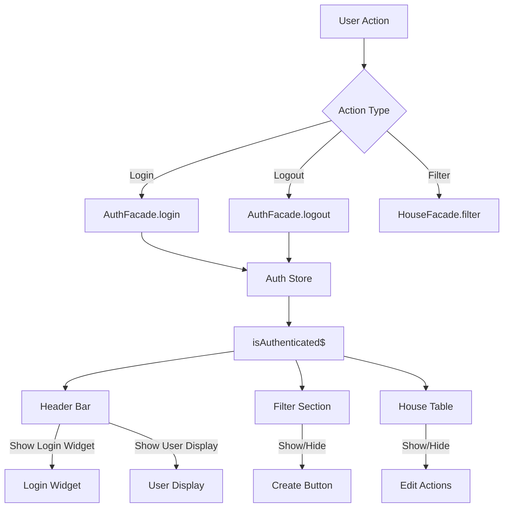

# Design Document: UI Layout Redesign

## Overview

This design document outlines the architectural changes required to transform the House Management System's UI from a sidenav-based layout to a streamlined single-page layout with inline authentication. The redesign focuses on simplifying navigation, integrating login functionality into the header, and implementing responsive horizontal filters.

## Architecture

### High-Level Component Structure

```
┌─────────────────────────────────────────────────────────────────┐
│                        App Shell                                 │
├─────────────────────────────────────────────────────────────────┤
│  Header Bar                                                      │
│  ┌─────────────┬────────────────────────────────────────────┐   │
│  │   Logo      │  [Login Widget] OR [User Display + Logout] │   │
│  └─────────────┴────────────────────────────────────────────┘   │
├─────────────────────────────────────────────────────────────────┤
│  Filter Section (horizontal on lg/xl)                            │
│  ┌──────────┬──────────┬──────────┬──────────┬────────────────┐ │
│  │ Block No │ Land No  │ Min Price│ Max Price│ [Create House] │ │
│  └──────────┴──────────┴──────────┴──────────┴────────────────┘ │
├─────────────────────────────────────────────────────────────────┤
│  Main Content (House List with Accordion)                        │
│  ┌─────────────────────────────────────────────────────────────┐│
│  │ House Model 1 house type                              [▼]   ││
│  ├─────────────────────────────────────────────────────────────┤│
│  │ House Model 2 house type                              [▲]   ││
│  │ ┌─────────────────────────────────────────────────────────┐ ││
│  │ │ Model media title          [Image]                      │ ││
│  │ │ Description text...                                     │ ││
│  │ ├─────────────────────────────────────────────────────────┤ ││
│  │ │ House# │ Block │ Land │ Price │ Status │ Action (Edit)  │ ││
│  │ └─────────────────────────────────────────────────────────┘ ││
│  └─────────────────────────────────────────────────────────────┘│
└─────────────────────────────────────────────────────────────────┘
```

### Data Flow



## Components and Interfaces

### 1. App Shell Component (Modified)

**File:** `apps/web/src/app/app.ts`

```typescript
interface AppShellState {
  title: string;
  isAuthenticated$: Observable<boolean>;
  currentUser$: Observable<AuthUserModel | null>;
}
```

**Changes:**
- Remove `MatSidenavModule` import
- Remove sidenav-related template code
- Remove hamburger menu button
- Simplify layout to single-column full-width
- Apply `width: 100%` to main content container to use full viewport width

**Design Decision:** The app shell becomes a simple vertical stack layout (header → filter → content) without any drawer or navigation chrome. This maximizes content area and simplifies the component structure.

### 1.1 Route Configuration Changes (Modified)

**File:** `apps/web/src/app/app.routes.ts`

**Changes:**
- Remove the `/auth/login` route definition
- Remove auth module lazy loading configuration (`loadChildren` for auth routes)
- Add redirect rule: `/auth/login` → `/houses` (for backward compatibility with bookmarks/links)

```typescript
// Before
{
  path: 'auth',
  loadChildren: () => import('@libs/auth/feature').then(m => m.AUTH_ROUTES)
}

// After - Remove the above and add redirect
{
  path: 'auth/login',
  redirectTo: '/houses',
  pathMatch: 'full'
}
```

**Design Decision:** Removing the dedicated login route simplifies the authentication flow. Users authenticate inline via the header widget. The redirect ensures existing links don't break.

### 2. Header Login Widget Component (New)

**File:** `libs/auth/ui/src/lib/header-login-widget/header-login-widget.component.ts`

```typescript
interface HeaderLoginWidgetInputs {
  // No inputs required
}

interface HeaderLoginWidgetOutputs {
  loginSubmit: EventEmitter<LoginCredentialsModel>;
}

interface HeaderLoginWidgetState {
  username: string;
  password: string;
  isSubmitting: boolean;
}
```

**Template Structure:**
- Inline form with username input, password input, and login button
- Compact horizontal layout suitable for header placement
- Error state handling via snackbar notifications

### 3. Header User Display Component (New)

**File:** `libs/auth/ui/src/lib/header-user-display/header-user-display.component.ts`

```typescript
interface HeaderUserDisplayInputs {
  username: string;
}

interface HeaderUserDisplayOutputs {
  logoutClick: EventEmitter<void>;
}
```

**Template Structure:**
- Display username text
- Logout button

**Behavior:**
- When logout button is clicked, emit `logoutClick` event
- Parent component (Header Bar) handles the event by calling `AuthFacade.logout()`
- Upon logout completion, the auth state changes to unauthenticated, which triggers the Header Bar to immediately replace User Display with Login Widget

**Design Decision:** The logout flow is reactive - the User Display doesn't manage the transition itself. It simply emits an event, and the auth state change propagates through the observable stream to trigger the UI swap.

### 4. House Filter Component (Modified)

**File:** `libs/houses/ui/src/lib/house-filter/house-filter.component.ts`

```typescript
interface HouseFilterInputs {
  availableBlocks: string[];
  availableLands: string[];
  initialFilter: HouseFilterModel;
  showCreateButton: boolean;  // NEW
}

interface HouseFilterOutputs {
  filterChange: EventEmitter<HouseFilterModel>;
  filterClear: EventEmitter<void>;
  createHouse: EventEmitter<void>;  // NEW
}
```

**Layout Changes:**
- Horizontal layout on lg/xl breakpoints using CSS flexbox/grid
- Responsive stacking on smaller viewports
- Create button positioned on the right
- Filter controls include: Block Number, Land Number, Min Price, Max Price dropdowns/inputs

**Responsive Behavior:**
- Large (lg) and Extra-Large (xl) viewports: All controls on single horizontal line with flexbox `flex-direction: row`
- Medium and smaller viewports: Controls stack vertically with `flex-direction: column`

**Design Decision:** Using CSS flexbox with media queries provides clean responsive behavior without JavaScript. The `showCreateButton` input allows the parent to control visibility based on auth state, keeping the filter component auth-agnostic.

### 5. House Table Component (Modified)

**File:** `libs/houses/ui/src/lib/house-table/house-table.component.ts`

```typescript
interface HouseTableInputs {
  houses: HouseModel[];
  showEditActions: boolean;  // Already exists, ensure proper usage
}
```

## Data Models

All data models follow a consistent pattern with enum mapping fields, request body interface, and class with constructor/parse methods.

### Login Credentials Model

**File:** `libs/auth/domain/src/lib/login-credentials.model.ts`

```typescript
export enum LOGIN_CREDENTIALS_MAPPING_FIELD {
  email = 'email',
  password = 'password',
  rememberMe = 'rememberMe'
}

export interface LoginCredentialsConvertToReqBody {
  [LOGIN_CREDENTIALS_MAPPING_FIELD.email]: string;
  [LOGIN_CREDENTIALS_MAPPING_FIELD.password]: string;
  [LOGIN_CREDENTIALS_MAPPING_FIELD.rememberMe]?: boolean;
}

export class LoginCredentialsModel {
  email!: string;
  password!: string;
  rememberMe?: boolean;

  constructor(respObject: any, isFromBackend = true) {
    if (isFromBackend) {
      this.parseFromBackend(respObject);
    } else {
      this.email = respObject.email;
      this.password = respObject.password;
      this.rememberMe = respObject.rememberMe;
    }
  }

  private parseFromBackend(respObject: any) {
    this.email = respObject[LOGIN_CREDENTIALS_MAPPING_FIELD.email];
    this.password = respObject[LOGIN_CREDENTIALS_MAPPING_FIELD.password];
    this.rememberMe = respObject[LOGIN_CREDENTIALS_MAPPING_FIELD.rememberMe];
  }

  public convertToReqBody(): LoginCredentialsConvertToReqBody {
    return {
      [LOGIN_CREDENTIALS_MAPPING_FIELD.email]: this.email,
      [LOGIN_CREDENTIALS_MAPPING_FIELD.password]: this.password,
      [LOGIN_CREDENTIALS_MAPPING_FIELD.rememberMe]: this.rememberMe
    };
  }
}
```

### Auth User Model

**File:** `libs/auth/domain/src/lib/auth-user.model.ts`

```typescript
export enum AUTH_USER_MAPPING_FIELD {
  id = 'id',
  email = 'email',
  firstName = 'firstName',
  lastName = 'lastName',
  roles = 'roles',
  isActive = 'isActive',
  createdAt = 'createdAt',
  updatedAt = 'updatedAt'
}

export interface AuthUserConvertToReqBody {
  [AUTH_USER_MAPPING_FIELD.id]: string;
  [AUTH_USER_MAPPING_FIELD.email]: string;
  [AUTH_USER_MAPPING_FIELD.firstName]: string;
  [AUTH_USER_MAPPING_FIELD.lastName]: string;
  [AUTH_USER_MAPPING_FIELD.roles]: string[];
  [AUTH_USER_MAPPING_FIELD.isActive]: boolean;
}

export class AuthUserModel {
  id!: string;
  email!: string;
  firstName!: string;
  lastName!: string;
  roles!: string[];
  isActive!: boolean;
  createdAt!: Date;
  updatedAt!: Date;

  constructor(respObject: any, isFromBackend = true) {
    if (isFromBackend) {
      this.parseFromBackend(respObject);
    } else {
      this.id = respObject.id;
      this.email = respObject.email;
      this.firstName = respObject.firstName;
      this.lastName = respObject.lastName;
      this.roles = respObject.roles;
      this.isActive = respObject.isActive;
      this.createdAt = respObject.createdAt;
      this.updatedAt = respObject.updatedAt;
    }
  }

  private parseFromBackend(respObject: any) {
    this.id = respObject[AUTH_USER_MAPPING_FIELD.id];
    this.email = respObject[AUTH_USER_MAPPING_FIELD.email];
    this.firstName = respObject[AUTH_USER_MAPPING_FIELD.firstName];
    this.lastName = respObject[AUTH_USER_MAPPING_FIELD.lastName];
    this.roles = respObject[AUTH_USER_MAPPING_FIELD.roles];
    this.isActive = respObject[AUTH_USER_MAPPING_FIELD.isActive];
    this.createdAt = new Date(respObject[AUTH_USER_MAPPING_FIELD.createdAt]);
    this.updatedAt = new Date(respObject[AUTH_USER_MAPPING_FIELD.updatedAt]);
  }

  public convertToReqBody(): AuthUserConvertToReqBody {
    return {
      [AUTH_USER_MAPPING_FIELD.id]: this.id,
      [AUTH_USER_MAPPING_FIELD.email]: this.email,
      [AUTH_USER_MAPPING_FIELD.firstName]: this.firstName,
      [AUTH_USER_MAPPING_FIELD.lastName]: this.lastName,
      [AUTH_USER_MAPPING_FIELD.roles]: this.roles,
      [AUTH_USER_MAPPING_FIELD.isActive]: this.isActive
    };
  }

  public getFullName(): string {
    return `${this.firstName} ${this.lastName}`;
  }
}
```

### House Filter Model

**File:** `libs/houses/domain/src/lib/house-filter.model.ts`

```typescript
export enum HOUSE_FILTER_MAPPING_FIELD {
  blockNumber = 'blockNumber',
  landNumber = 'landNumber',
  houseType = 'houseType',
  status = 'status',
  minPrice = 'minPrice',
  maxPrice = 'maxPrice',
  sortBy = 'sortBy',
  sortOrder = 'sortOrder'
}

export interface HouseFilterConvertToReqBody {
  [HOUSE_FILTER_MAPPING_FIELD.blockNumber]?: string;
  [HOUSE_FILTER_MAPPING_FIELD.landNumber]?: string;
  [HOUSE_FILTER_MAPPING_FIELD.houseType]?: HouseType;
  [HOUSE_FILTER_MAPPING_FIELD.status]?: HouseStatus;
  [HOUSE_FILTER_MAPPING_FIELD.minPrice]?: number;
  [HOUSE_FILTER_MAPPING_FIELD.maxPrice]?: number;
  [HOUSE_FILTER_MAPPING_FIELD.sortBy]?: string;
  [HOUSE_FILTER_MAPPING_FIELD.sortOrder]?: 'asc' | 'desc';
}

export class HouseFilterModel {
  blockNumber?: string;
  landNumber?: string;
  houseType?: HouseType;
  status?: HouseStatus;
  minPrice?: number;
  maxPrice?: number;
  sortBy?: string;
  sortOrder?: 'asc' | 'desc';

  constructor(respObject: any, isFromBackend = true) {
    if (isFromBackend) {
      this.parseFromBackend(respObject);
    } else {
      this.blockNumber = respObject.blockNumber;
      this.landNumber = respObject.landNumber;
      this.houseType = respObject.houseType;
      this.status = respObject.status;
      this.minPrice = respObject.minPrice;
      this.maxPrice = respObject.maxPrice;
      this.sortBy = respObject.sortBy;
      this.sortOrder = respObject.sortOrder;
    }
  }

  private parseFromBackend(respObject: any) {
    this.blockNumber = respObject[HOUSE_FILTER_MAPPING_FIELD.blockNumber];
    this.landNumber = respObject[HOUSE_FILTER_MAPPING_FIELD.landNumber];
    this.houseType = respObject[HOUSE_FILTER_MAPPING_FIELD.houseType];
    this.status = respObject[HOUSE_FILTER_MAPPING_FIELD.status];
    this.minPrice = respObject[HOUSE_FILTER_MAPPING_FIELD.minPrice];
    this.maxPrice = respObject[HOUSE_FILTER_MAPPING_FIELD.maxPrice];
    this.sortBy = respObject[HOUSE_FILTER_MAPPING_FIELD.sortBy];
    this.sortOrder = respObject[HOUSE_FILTER_MAPPING_FIELD.sortOrder];
  }

  public convertToReqBody(): HouseFilterConvertToReqBody {
    return {
      [HOUSE_FILTER_MAPPING_FIELD.blockNumber]: this.blockNumber,
      [HOUSE_FILTER_MAPPING_FIELD.landNumber]: this.landNumber,
      [HOUSE_FILTER_MAPPING_FIELD.houseType]: this.houseType,
      [HOUSE_FILTER_MAPPING_FIELD.status]: this.status,
      [HOUSE_FILTER_MAPPING_FIELD.minPrice]: this.minPrice,
      [HOUSE_FILTER_MAPPING_FIELD.maxPrice]: this.maxPrice,
      [HOUSE_FILTER_MAPPING_FIELD.sortBy]: this.sortBy,
      [HOUSE_FILTER_MAPPING_FIELD.sortOrder]: this.sortOrder
    };
  }

  public hasActiveFilters(): boolean {
    return !!(this.blockNumber || this.landNumber || this.houseType || 
              this.status || this.minPrice || this.maxPrice);
  }
}
```

## Correctness Properties

*A property is a characteristic or behavior that should hold true across all valid executions of a system-essentially, a formal statement about what the system should do. Properties serve as the bridge between human-readable specifications and machine-verifiable correctness guarantees.*

### Property 1: Login Widget and User Display Mutual Exclusivity

*For any* authentication state, exactly one of the following is true: either the Login_Widget is visible (when unauthenticated) OR the User_Display is visible (when authenticated). They are never both visible or both hidden simultaneously.

**Validates: Requirements 2.1, 2.2, 3.1, 3.2**

### Property 2: Create Button Visibility Invariant

*For any* authentication state, the "Create new house" button is visible in the Filter_Section if and only if the user is authenticated.

**Validates: Requirements 6.1, 6.2, 6.3**

### Property 3: Edit Action Visibility Invariant

*For any* authentication state and any house in the House_List, the "Edit" action link is visible if and only if the user is authenticated.

**Validates: Requirements 7.1, 7.2, 7.3**

### Property 4: Auth State Transition Consistency

*For any* successful login action, the UI state transitions from showing Login_Widget to showing User_Display with the authenticated user's username.

**Validates: Requirements 2.3, 2.4, 3.3**

## Error Handling

### Authentication Errors

| Error Scenario | Handling Strategy |
|----------------|-------------------|
| Invalid credentials | Display snackbar notification with error message, maintain login widget state |
| Network failure | Display snackbar notification with retry suggestion |
| Session expired | Automatically show login widget, display session expired message |

### UI State Errors

| Error Scenario | Handling Strategy |
|----------------|-------------------|
| Auth state undefined | Default to unauthenticated state (show login widget) |
| User data missing | Display generic "User" text instead of username |

## Testing Strategy

### Unit Tests

Unit tests will verify specific component behaviors and edge cases:

1. **Header Login Widget Tests**
   - Form validation (required fields)
   - Submit button disabled state when form invalid
   - Emit event on valid form submission
   - Error notification display on failed authentication

2. **Header User Display Tests**
   - Username display rendering
   - Logout button click event emission

3. **App Shell Tests**
   - No sidenav elements present
   - No hamburger menu button present
   - Full-width layout applied (100% viewport width)
   - Correct component shown based on auth state

4. **Route Configuration Tests**
   - '/auth/login' route does not exist as a loadable route
   - Navigation to '/auth/login' redirects to '/houses'
   - Auth module lazy loading is removed

5. **House Filter Tests**
   - Horizontal layout on large viewports (lg/xl)
   - Stacked layout on medium and smaller viewports
   - Create button visibility based on `showCreateButton` input
   - All filter controls present (Block Number, Land Number, Min Price, Max Price)
   - Create button positioned on the right

### Property-Based Tests

Property-based testing will validate the correctness properties using fast-check for TypeScript.

**Configuration:**
- Minimum 100 iterations per property test
- Each test tagged with feature and property reference

**Test Implementation Approach:**

1. **Property 1 Test (Login Widget XOR User Display)**: Generate random boolean auth states, verify exactly one of login widget or user display is visible - never both, never neither.

2. **Property 2 Test (Create Button Visibility)**: Generate random auth states, verify create button visibility matches auth state exactly.

3. **Property 3 Test (Edit Action Visibility)**: Generate random auth states and house lists of varying sizes, verify edit action visibility matches auth state for all houses in the list.

4. **Property 4 Test (Auth State Transition)**: Generate random valid credentials, simulate login, verify UI transitions from login widget to user display with correct username.

**Test Tagging Format:**
```typescript
// Feature: ui-layout-redesign, Property 1: Login Widget and User Display Mutual Exclusivity
```

### Integration Tests

- Login flow: Enter credentials → Submit → Verify UI transition to user display
- Logout flow: Click logout → Verify UI transition to login widget
- Filter interaction with auth state changes
- Route redirect: Navigate to '/auth/login' → Verify redirect to '/houses'
